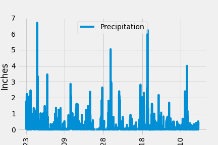
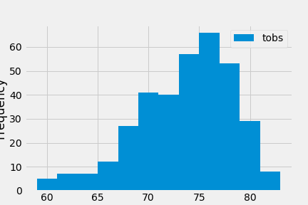

# SQLAlchemy Homework - Surfs Up!

## Step 1 - Climate Analysis and Exploration

Python and SQLAlchemy were to perform basic climate analysis and data exploration of a climate database. 

* The files (climate_starter.ipynb) and [hawaii.sqlite](Resources/hawaii.sqlite) were used to complete the climate analysis and data exploration.

* SQLAlchemy features `create_engine` and `automap_base()` were used in this analysis.

### Precipitation Analysis

* The most recent data in the data set was identified. Then, the data set from the last 12 months  of precipitation data was queried. The query results were loaded into a Pandas DataFrame and ploted using matplotlib.

The summary statistics for the precipitation data were diplayed with Pandas.

### Station Analysis

* The total number of stations in the dataset was calculated. The most active stations was pointed and the lowest, highest, and average temperature was calculated for this station.

The last 12 months of temperature observation data (TOBS) was queried. THe station with the highest number of observations was filtered. The results were ploted in a histogram with `bins=12`.

    

## Step 2 - Climate App

A Flask API was designed based on the queries developed an the step 1.

### Routes

* `/`

  * Home page with all routes that are available.

* `/api/v1.0/precipitation`

  * Convert the query results to a dictionary using `date` as the key and `prcp` as the value.

  * Return the JSON representation of your dictionary.

* `/api/v1.0/stations`

  * Return a JSON list of stations from the dataset.

* `/api/v1.0/tobs`
  * Query the dates and temperature observations of the most active station for the last year of data.

  * Return a JSON list of temperature observations (TOBS) for the previous year.

* `/api/v1.0/<start>` and `/api/v1.0/<start>/<end>`

  * Return a JSON list of the minimum temperature, the average temperature, and the max temperature for a given start or start-end range.

  * When given the start only, calculate `TMIN`, `TAVG`, and `TMAX` for all dates greater than and equal to the start date.

  * When given the start and the end date, calculate the `TMIN`, `TAVG`, and `TMAX` for dates between the start and end date inclusive.
